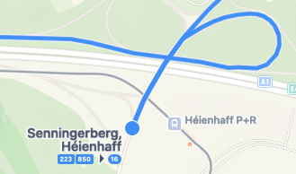
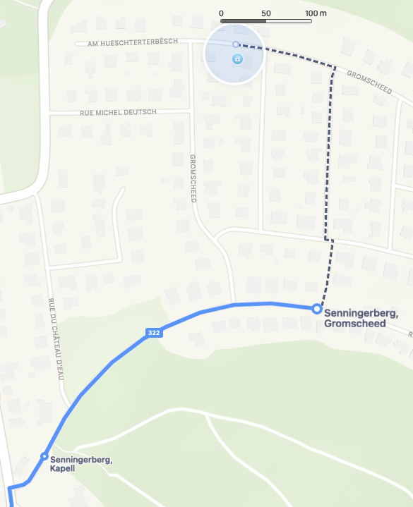
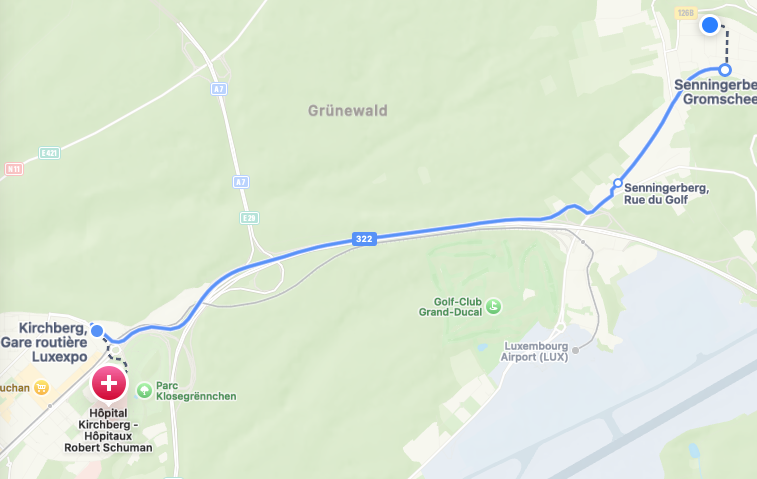

# Map trace design

Journey timelines, line details, and trip details share the same MapKit trace
renderer. This is the default for future route-map work. Ordinary nearby-stop
pins and the native user-location indicator keep their existing behavior.

## References

User-provided Apple Maps screenshots describe the visual direction, rather than
an API contract. The sample app geometry used for inspection is explicitly
labeled and is never a substitute for production data.

## Visual rules

| Element | Rule |
| --- | --- |
| Transit/bicycle stroke | 5 pt, rounded caps and joins, subtle 7 pt adaptive casing |
| Mode color | Canonical `TransportMode.tint`: bus blue, train red, tram orange, funicular purple, bicycle teal |
| Walking/unknown color | Adaptive neutral gray |
| Walking stroke | 3 pt; 6 pt dash, 4 pt gap |
| Approximate transit geometry | Dashed, including within highlighted trip geometry |
| Intermediate stop | 8 pt ring, 2 pt border, adaptive white/dark center |
| Boarding/alighting/transfer | 12 pt ring, 2.5 pt border |
| Full-line/trip terminus | 16 pt filled circle with contrasting border; boarding/alighting takes priority |
| Stop name | Primary text color, semibold 12 pt base, scaled as caption text, wraps without a line cap, adaptive halo |
| Line shield | Upright rounded rectangle, mode color, white bold 10 pt base, Dynamic Type |
| Full-trip context | Same mode hue at 55% stroke opacity; highlighted ride drawn above it |

The public short line name is separate from the descriptive route name. Do not
derive line numbers from route IDs or long names. Omit shields when no short
name is supplied. Route IDs never select a color or shade.

Key stop circles have highest placement priority, followed by key names,
shields, and intermediate details. Names try the right and then the left side.
Lower-priority content is hidden when it does not fit. Intermediate stops
appear when the viewport scale is at most four meters per screen point and
there is room. A shield is placed on the longest visible portion of its route,
trying the middle and nearby alternate positions. Invisible and very short
paths get no shield. These rules avoid collisions among our own decorations;
MapKit controls basemap labels separately.

## Data and update contract

`RouteMapOverlayBuilder` maps source data without networking. Journey legs
retain ordered `RouteStopOccurrence` values, including both endpoints and
intermediate visits. Occurrence IDs include the leg and visit identity;
repeated physical stops in a loop must remain separate occurrences.

Only coincident stop boundaries of adjacent transit legs can merge. Walking
interchanges retain their separate stop locations. In-seat continuations do
not create transfer markers. Line and trip maps use their own real ordered
stop sequences. No geometry is synthesized to connect missing route shapes.

The same itinerary builder is used after walking, shape, and realtime updates.
Added Codable metadata is optional or decodes missing collections as empty.
Old saved overlays retain their geometry and old transfer markers render as
small rings.

Route content is synchronized by stable identity. Unchanged camera/sheet updates
do not rebuild polylines or annotation objects. Layout is coalesced during map
gestures and recomputed at their end, after resizing, and when text size changes.
Appearance changes replace renderer colors while retaining geometry. Drawing
uses immutable paths and colors because MapKit may draw tiles concurrently.

Stop circles are display-only, with VoiceOver names, modes, and roles. Shields
are decorative and excluded from VoiceOver. The journey and trip sheets remain
the accessible textual source for the complete stop sequence.

## Reproduction and tests

In a Debug simulator build, launch with `--map-trace-preview`. Optionally use
`--trace-scenario journey`, `loop`, `transfer`, or `trip`. The host provides a
draggable sheet and a scenario picker. Review overview/street zoom, light/dark
appearance, accessibility text sizes, and map interaction. SwiftUI previews
provide light, dark, and large-text variants.

Swift Testing suites cover mapping and compatibility, screen-space placement,
mode colors, annotation updates, Dynamic Type, and display-only behavior.
The package-integration tests also check source stop and line-label mapping.
Build and run the full suite with the commands in `AGENTS.md`.
